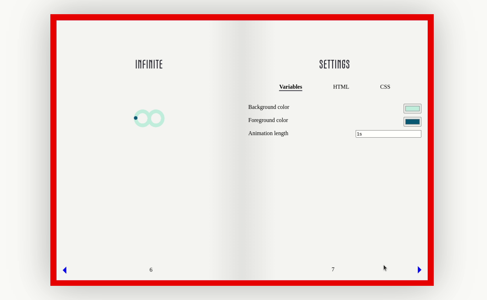
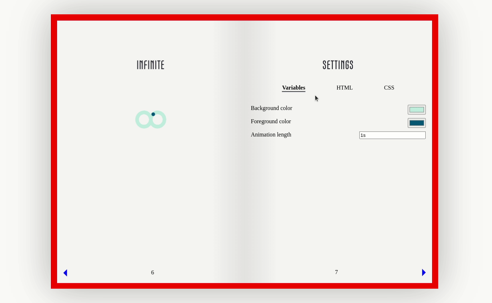
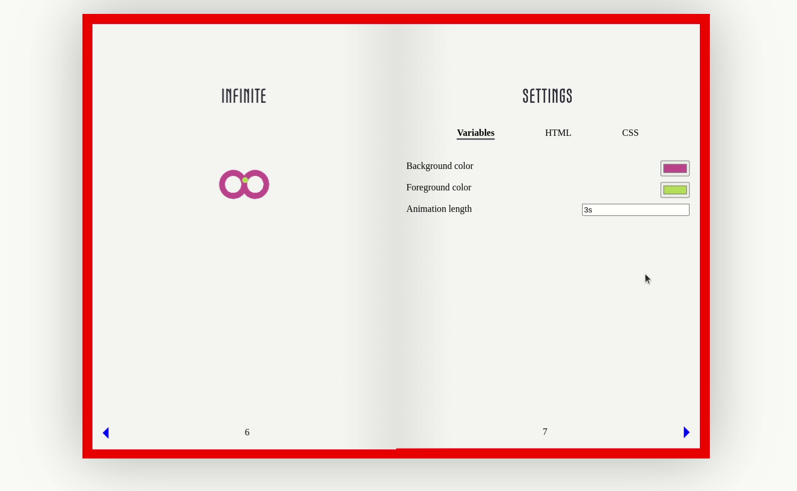
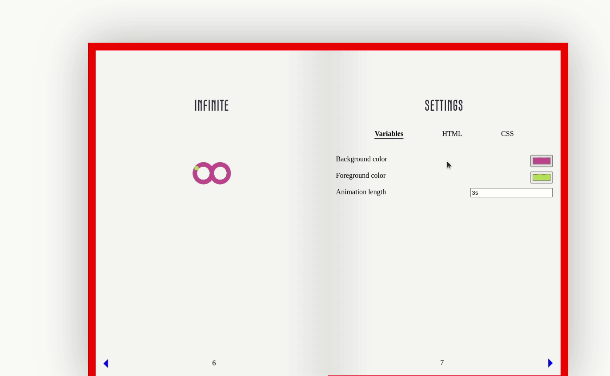

# Book page flipping

Animations with settings form in a catalog.

Page flip animation with css and a little javascript. You can click on the arrows to turn the pages.

Every chapter contains an animation (left) and a settings page (right). You can make changes on the animation with updating the values on the settings page, in the `Variables` paragraph.

The necessary html and css code for the visible animation is shown in the `HTML` and `CSS` paragraphs. You can switch to them by clicking on their names.

After you set the variables, you can copy the HTML and CSS codes from the paragraphs by clicking to the `Copy to clipboard` button and paste it to your page.

You can try it out on the [github page](https://akosgarai.github.io/loading-animation-catalog/).
